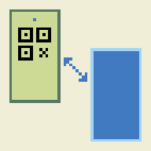

# QR-to-QR

*Version 0.0.0*

  

This novelty app enables a pair of phones
(that have front facing cameras),
to share text using QR codes.

  

Instructions:
- Put phone A into send mode.
- Put phone B into receive mode.
- Put the two phones face to face (experiment with the distance).
- You should see the QRs change, and the text gradually appearing on phone B.

<!-- [INSERT VIDEO HERE] -->
